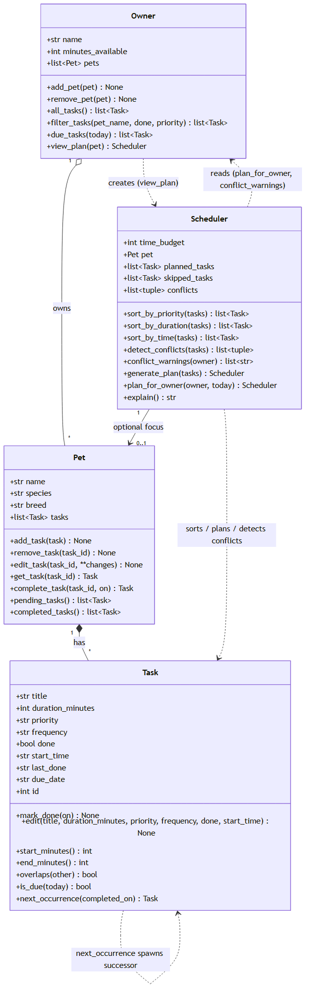

# PawPal+ (Module 2 Project)

**PawPal+** is a Streamlit app that helps a pet owner plan the day's care tasks for one or
more pets, working around the time they have, each task's priority, and any fixed times of day.

## Scenario

A busy pet owner needs help staying consistent with pet care. They want an assistant that can:

- Track pet care tasks (walks, feeding, meds, enrichment, grooming, etc.)
- Consider constraints (time available, priority, owner preferences)
- Produce a daily plan and explain why it chose that plan

Your job is to design the system first (UML), then implement the logic in Python, then connect it to the Streamlit UI.

## ✨ Features

- **Owners, pets, and tasks** — track multiple pets under one owner, each with its own
  care tasks (title, duration, priority, optional fixed start time, and repeat rule).
- **Priority-first daily planning** — `generate_plan` greedily packs the highest-priority
  tasks that fit the owner's available minutes; anything that doesn't fit is listed as
  *skipped*, so the plan explains itself.
- **Sorting by time** — `sort_by_time` orders tasks chronologically by `start_time`, with
  untimed tasks pushed to the end (no crashes on mixed lists).
- **Sorting by duration** — `sort_by_duration` orders shortest-first to clear the most
  items when time is tight.
- **Sorting by priority** — `sort_by_priority` orders high→low, breaking ties by shorter
  duration so more high-value tasks fit the budget.
- **Filtering** — `filter_tasks` narrows tasks by pet, completion status, and/or priority
  from a single flexible entry point.
- **Conflict warnings** — `detect_conflicts` finds overlapping timed tasks (half-open
  interval test) and `conflict_warnings` turns each clash into a plain-language warning
  that labels same-pet vs. cross-pet double-bookings — it reports, it never crashes.
- **Daily & weekly recurrence** — completing a recurring task (`complete_task`) marks it
  done and auto-creates the next occurrence, due tomorrow (daily) or in 7 days (weekly);
  one-off tasks don't regenerate.
- **Due-date awareness** — `is_due` / `due_tasks` keep not-yet-due future occurrences out
  of today's plan.
- **Streamlit UI + CLI** — plan interactively in `app.py`, or run `main.py` for a scripted
  end-to-end demo.
- **Tested** — 27 pytest cases cover sorting, recurrence, conflicts, and budget edge cases.

## Getting started

### Setup

```bash
python -m venv .venv
source .venv/bin/activate  # Windows: .venv\Scripts\activate
pip install -r requirements.txt
```

### Suggested workflow

1. Read the scenario carefully and identify requirements and edge cases.
2. Draft a UML diagram (classes, attributes, methods, relationships).
3. Convert UML into Python class stubs (no logic yet).
4. Implement scheduling logic in small increments.
5. Add tests to verify key behaviors.
6. Connect your logic to the Streamlit UI in `app.py`.
7. Refine UML so it matches what you actually built.

## 📐 UML Class Diagram

The final class design (kept in sync with `pawpal_system.py`) lives in
[`diagrams/uml_final.mmd`](diagrams/uml_final.mmd) as Mermaid source, exported to
`diagrams/uml_final.png`:



Four classes: **Owner** owns **Pet**s, each **Pet** has **Task**s, and the
**Scheduler** reads an Owner's tasks to sort, plan, and flag conflicts. A
recurring **Task** spawns its own successor via `next_occurrence`.

## 🖥️ Sample Output

Running `python main.py` builds a schedule for an owner with two pets and a
60-minute daily budget. The scheduler pulls tasks across all pets, fits the
highest-priority ones that stay within the budget, and lists the rest under
"Skipped" so it's clear *why* they didn't make the plan:

```
========================================
Today's Schedule for Jordan
========================================
Daily plan (60 min available):
  - Litter box (8 min) [priority: high]
  - Feeding (10 min) [priority: high]
  - Morning walk (30 min) [priority: high]
Skipped (not enough time):
  - Play/enrichment (15 min) [priority: medium]
  - Grooming (25 min) [priority: low]
```

## 🧪 Testing PawPal+

Run the full test suite from the project root:

```bash
python -m pytest
```

### What the tests cover

The 27 tests in `tests/test_pawpal.py` exercise the logic layer in
`pawpal_system.py` across happy paths and edge cases:

- **Sorting correctness** — tasks come back in chronological order by
  `start_time`, shortest-duration first, and untimed tasks sink to the end
  instead of crashing.
- **Recurrence logic** — completing a daily task marks it done and spawns a
  fresh occurrence due the following day; weekly tasks land 7 days out; `once`
  tasks never regenerate; `is_due` boundaries (on/before the due date).
- **Conflict detection** — duplicate/overlapping start times are flagged,
  adjacent non-overlapping tasks are not (half-open intervals), untimed tasks
  never conflict, and three same-time tasks produce three pairs.
- **Budget-constrained planning** — exact-fit and one-over-budget boundaries,
  zero budget, priority + duration tie-breaking, and exclusion of already-done
  tasks.
- **Filtering & degenerate inputs** — filtering by pet/status/priority, plus a
  pet with no tasks and an owner with no pets (no crashes, empty plans).

### Successful test run

```
============================= test session starts =============================
platform win32 -- Python 3.14.5, pytest-9.1.1, pluggy-1.6.0
rootdir: C:\Users\Somdu\OneDrive\Desktop\Coding\CodePath\AI110\ai110-module2show-pawpal-starter
collected 27 items

tests\test_pawpal.py ...........................                         [100%]

============================= 27 passed in 0.02s ==============================
```

### Confidence Level

**★★★★☆ (4 / 5)**

All 27 tests pass, covering every core behavior — sorting, recurrence, conflict
detection, and budget-constrained planning — including boundary cases (exact-fit
budgets, half-open time intervals, on/before due dates) and degenerate inputs
(no pets, no tasks). I'm holding back the fifth star because one behavior remains
unspecified rather than proven: `Task.next_occurrence` dates the next occurrence
from *when the task was completed*, not from its original `due_date`, so a
late-completed recurring task drifts. Once that intended behavior is decided and
pinned with a test, this moves to 5/5.

## 📐 Smarter Scheduling

Beyond the basic "pack by priority" plan, PawPal+ adds four pieces of smarter
scheduling logic. Each row names the exact method that implements it (all in
`pawpal_system.py`).

| Feature | Method(s) | Notes |
|---------|-----------|-------|
| Task sorting | `Scheduler.sort_by_time()`, `Scheduler.sort_by_duration()`, `Scheduler.sort_by_priority()`, `Scheduler.sort_by_priority_then_time()` | Chronological (by `start_time`), shortest-first (by duration), highest-priority-first, or **priority-first-then-time** (the plan's presentation order) |
| Filtering | `Owner.filter_tasks()`, `Pet.pending_tasks()`, `Pet.completed_tasks()` | Filter by pet name, completion status, and/or priority |
| Conflict handling | `Scheduler.detect_conflicts()`, `Scheduler.conflict_warnings()`, `Task.overlaps()` | Flags overlapping time windows (same or different pets); returns warning strings instead of crashing |
| Recurring tasks | `Task.is_due()`, `Task.next_occurrence()`, `Pet.complete_task()` | Completing a daily/weekly task auto-creates the next occurrence (`today + timedelta`) |

### Sorting behavior

- **`Scheduler.sort_by_time(tasks)`** — orders tasks chronologically by their
  `start_time` (`"HH:MM"`). Untimed tasks (`start_time is None`) sort to the end
  instead of raising an error.
- **`Scheduler.sort_by_duration(tasks)`** — orders by time cost, shortest first.
- **`Scheduler.sort_by_priority(tasks)`** — highest priority first, ties broken by
  shorter duration (used to *select* tasks so the most high-value ones fit the budget).
- **`Scheduler.sort_by_priority_then_time(tasks)`** — the schedule's presentation order:
  **priority first, then time of day**. Highest-priority tasks come first, and within a
  single priority level they run chronologically by `start_time` (untimed tasks fall to the
  end of their band). `generate_plan` orders the final plan with this method.

#### Priority-Based Scheduling (priority first, then time)

Each `Task` carries a priority level (**low / medium / high**, weighted by `PRIORITY_ORDER`).
The scheduler orders the day by importance first and only *then* by clock time, so a critical
task never gets buried just because something trivial happens earlier in the day. The CLI output
below contrasts a plain time sort with the priority-then-time sort — note how the high-priority
`Evening meds` (18:00) jumps to the top under priority-based scheduling instead of sitting last:

```
Sorted by TIME only (sort_by_time) -- ignores importance:
  08:00  Morning feed     [priority: high]
  12:00  Midday walk      [priority: medium]
  14:00  Afternoon play   [priority: low]
  18:00  Evening meds     [priority: high]

Sorted by PRIORITY, then TIME (sort_by_priority_then_time):
  08:00  Morning feed     [priority: high]
  18:00  Evening meds     [priority: high]
  12:00  Midday walk      [priority: medium]
  14:00  Afternoon play   [priority: low]

============================================
Today's Schedule for Jordan
============================================
Daily plan (60 min available):
  - 08:00 Morning feed (10 min) [priority: high]
  - 18:00 Evening meds (5 min) [priority: high]
  - 12:00 Midday walk (20 min) [priority: medium]
  - 14:00 Afternoon play (15 min) [priority: low]
```

### Filtering behavior

- **`Owner.filter_tasks(pet_name=None, done=None, priority=None)`** — one flexible
  entry point; any argument left `None` is ignored, so
  `owner.filter_tasks(pet_name="Mochi", done=False)` returns Mochi's outstanding
  tasks.
- **`Pet.pending_tasks()` / `Pet.completed_tasks()`** — quick status filters on a
  single pet.

### Conflict detection logic

- **`Task.overlaps(other)`** — half-open interval test on
  `[start, start + duration)`; untimed tasks never conflict.
- **`Scheduler.detect_conflicts(tasks=None)`** — returns every pair of planned
  tasks whose windows overlap (defaults to `planned_tasks`).
- **`Scheduler.conflict_warnings(owner=None)`** — lightweight: turns each conflict
  into a readable warning **string** (never raises), noting whether the clash is
  within one pet (`for Biscuit`) or across two (`Biscuit vs Mochi`).

### Recurring task logic

- **`Task.is_due(today)`** — a done task is never due again; a pending task is due
  once `today` reaches its `due_date`.
- **`Task.next_occurrence(completed_on)`** — factory returning a fresh Task due
  `completed_on + timedelta(days=1)` (daily) or `+7` (weekly); `None` for `"once"`.
- **`Pet.complete_task(task_id, on)`** — marks a task done **and** auto-appends its
  next occurrence, so recurring chores reschedule themselves.

## 🎬 Demo Walkthrough

### Launch the app

```bash
streamlit run app.py
```

### What you can do in the UI

The app is organized top-to-bottom into a few sections:

- **👤 Owner** — set your name and the minutes you have available today (the plan's budget).
- **🐕 Add a Pet** — register a pet (name, species, breed). You can add several.
- **📝 Add a Task** — for a chosen pet, enter a title, duration, and priority, pick a repeat
  rule (`once` / `daily` / `weekly`), and optionally give it a fixed start time (timed tasks
  are the only ones that can conflict).
- **🔍 Browse Tasks** — filter by pet / status / priority and sort by **time of day**,
  **duration**, or **priority**; results show in a table. From here you can also **mark a
  task complete**, which auto-schedules its next occurrence.
- **📅 Build Schedule** — generates today's plan: conflict warnings appear first (yellow),
  then the planned tasks in chronological order (green), then a table of tasks skipped for
  lack of time.

### Example workflow

1. Set **Minutes available today** to `90`.
2. **Add a pet** — "Biscuit" (dog).
3. **Add tasks** to Biscuit — e.g. "Feeding" (10 min, high, `08:00`, daily) and
   "Morning meds" (5 min, high, `08:00`, daily). Add a second pet "Mochi" with a "Vet call"
   (5 min, high, `08:00`).
4. Open **🔍 Browse Tasks**, sort by **Time of day**, and see the tasks ordered chronologically.
5. Click **Mark complete** on a daily task and watch PawPal+ report the auto-scheduled next
   occurrence (due tomorrow).
6. Click **Generate schedule**: PawPal+ packs the high-priority tasks into 90 minutes, warns
   that the three `08:00` tasks overlap (labeling same-pet vs. cross-pet clashes), and lists
   anything that didn't fit.

### Key Scheduler behaviors on display

- **Sorting** — the schedule is printed in chronological order; Browse Tasks demonstrates all
  three sort strategies.
- **Priority-first budgeting** — high-priority tasks are chosen first; overflow is shown as skipped.
- **Conflict warnings** — overlapping timed tasks are flagged in plain language, noting which
  pet(s) are double-booked, without ever crashing.
- **Recurrence** — completing a daily/weekly task spawns its next occurrence automatically.

### Sample CLI output (`python main.py`)

The same logic runs headless via `main.py`, which completes two recurring tasks, demonstrates
each sort, filters tasks, and builds a conflict-laden plan for an owner with two pets:

```
Completed 'Litter box' (daily) on 2026-07-08.
  -> next occurrence auto-created, due 2026-07-09

Completed 'Grooming' (weekly) on 2026-07-08.
  -> next occurrence auto-created, due 2026-07-15

Tasks added out of order, now sorted by time:
  08:00  Feeding
  08:00  Morning meds
  08:00  Vet call
  09:00  Litter box
  09:00  Litter box
  09:05  Play/enrichment
  18:00  Evening walk
    --  Grooming
    --  Grooming

Same tasks sorted by duration (shortest first):
  - Morning meds (5 min)
  - Vet call (5 min)
  - Litter box (8 min)
  - Litter box (8 min)
  - Feeding (10 min)
  - Play/enrichment (15 min)
  - Grooming (25 min)
  - Grooming (25 min)
  - Evening walk (30 min)

Mochi's tasks still to do (done=False):
  - Play/enrichment
  - Vet call
  - Litter box

Everything already completed (done=True):
  - Grooming
  - Litter box

All high-priority tasks:
  - Evening walk
  - Feeding
  - Morning meds
  - Litter box
  - Vet call
  - Litter box

========================================
Today's Schedule for Jordan
========================================
Daily plan (90 min available):
  - 08:00 Morning meds (5 min) [priority: high]
  - 08:00 Vet call (5 min) [priority: high]
  - 08:00 Feeding (10 min) [priority: high]
  - 18:00 Evening walk (30 min) [priority: high]
  - 09:05 Play/enrichment (15 min) [priority: medium]
Time conflicts (overlapping tasks):
  ! Morning meds (08:00) overlaps Vet call (08:00)
  ! Morning meds (08:00) overlaps Feeding (08:00)
  ! Vet call (08:00) overlaps Feeding (08:00)

Schedule check:
  WARNING: time conflict (Biscuit vs Mochi): 'Morning meds' at 08:00 overlaps 'Vet call' at 08:00.
  WARNING: time conflict for Biscuit: 'Morning meds' at 08:00 overlaps 'Feeding' at 08:00.
  WARNING: time conflict (Mochi vs Biscuit): 'Vet call' at 08:00 overlaps 'Feeding' at 08:00.
```

**Screenshots** *(optional, for human reviewers)*: <!-- Insert screenshots of the Streamlit app here -->
